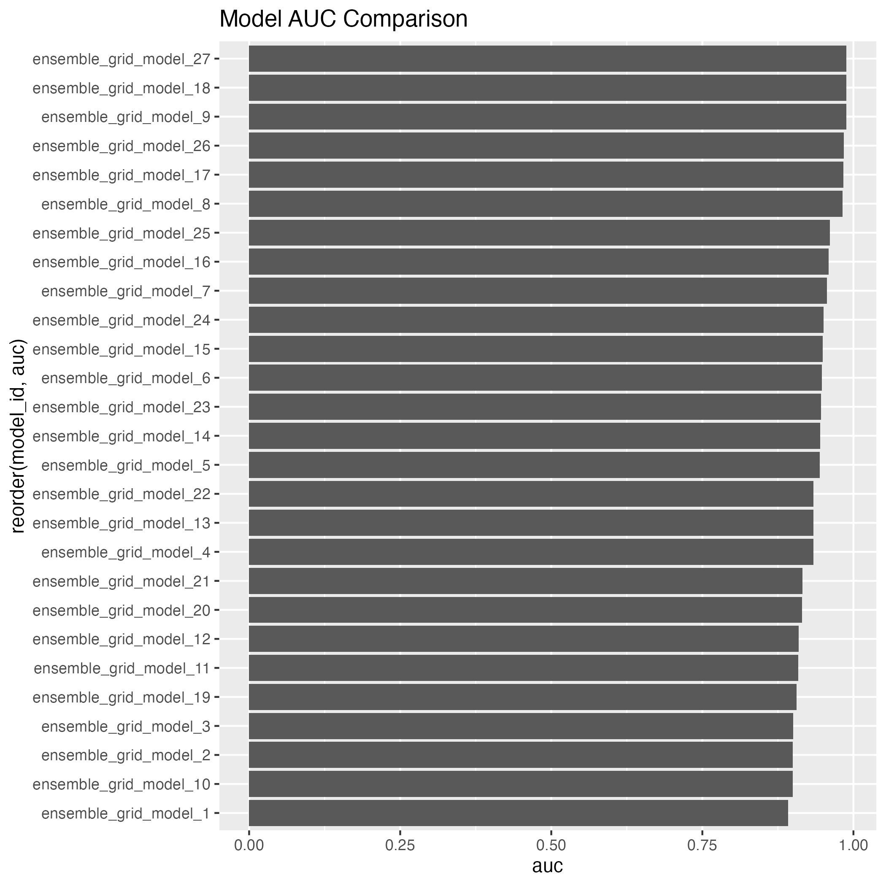
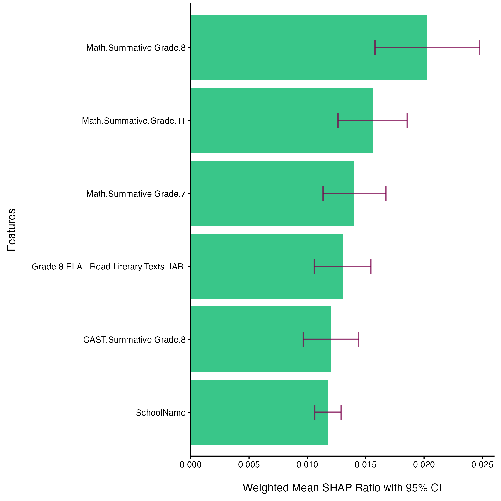
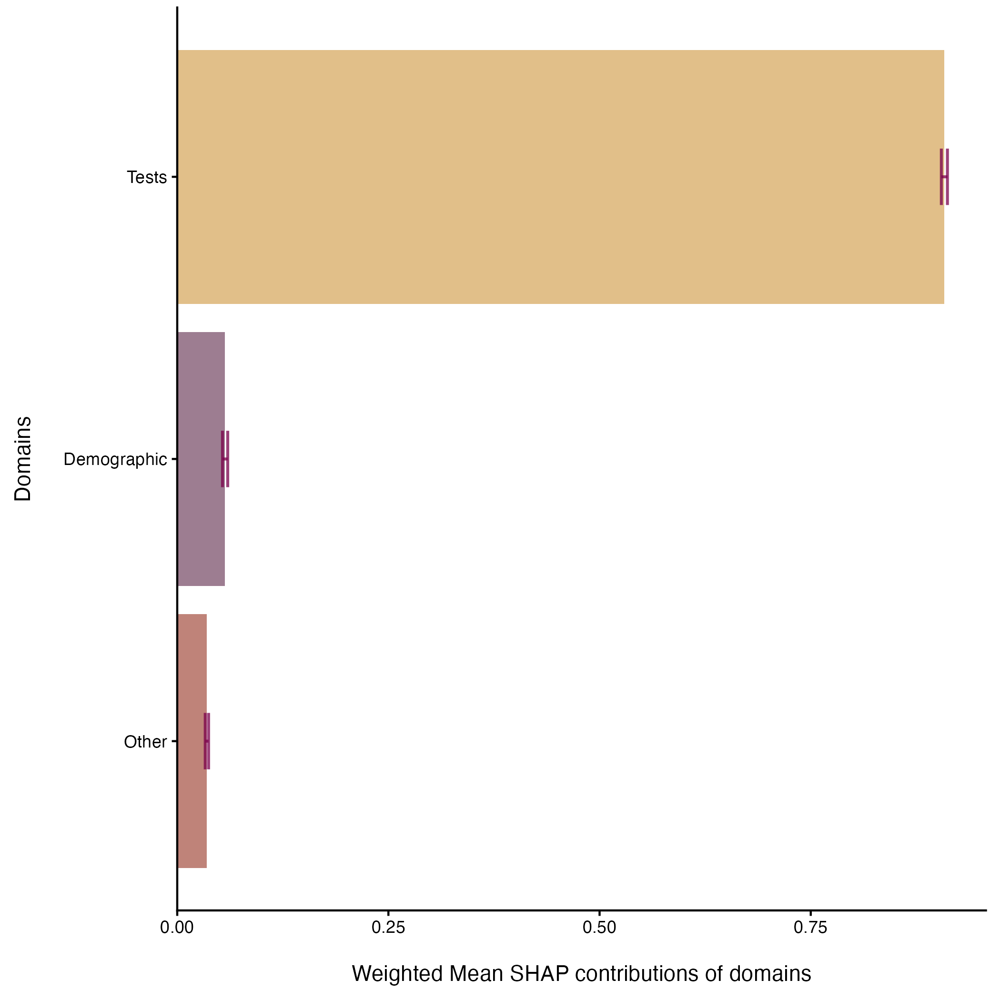

## Overview

Educational agencies collect large volumes of student assessment data across multiple tests within a single academic year. However, not all assessments are equally informative for predicting outcomes on high-stakes exams.

This project answers a practical question:

> **Which same-year assessment results are most strongly associated with whether a student passes the ELA state exam?**

To address this, I built a supervised machine learning pipeline and applied **SHAP (Shapley Additive Explanations)** to quantify feature importance—augmented with **confidence intervals** to assess the stability of those importance estimates.

------------------------------------------------------------------------

## Key Takeaways

-   **Math summative assessments were the strongest predictors of ELA outcomes**, consistently ranking highest across SHAP importance metrics.
-   **Science assessments also showed some predictive value**, reinforcing cross-disciplinary alignment in student performance.
-   **Demographic and school-level variables had relatively low importance**, suggesting limited predictive contribution in this model.
-   **Feature importance rankings were stable**, supported by narrow confidence intervals.

**Interpretation:**\
Student achievement behaves as a *generalized academic signal*, not a collection of isolated subject-specific outcomes.

------------------------------------------------------------------------

## Method

### Modeling Approach

-   **Problem Type:** Binary classification (ELA pass vs. not pass)\
-   **Model Type:** Random Forest (H2O)\
-   **Why Random Forest?**
    -   Handles nonlinear relationships
    -   Robust to correlated predictors
    -   Works well with mixed data types

#### Model Validation

Model performance was evaluated on a held-out test set to ensure that predictions reflect generalizable patterns rather than overfitting.

{width="1210"}

The models achieved performance above a random baseline (AUC \> 0.50), indicating that they capture meaningful structure in the data. While predictive performance is not the primary objective of this analysis, this validation step ensures that SHAP-based feature importance results are grounded in a model with non-random predictive signal.

### Interpretability Layer

-   **Technique:** SHAP values\
-   **Purpose:** Attribute each prediction to feature-level contributions\
-   **Key Property:** Additivity — feature contributions sum to the model prediction difference from baseline

### Addressing SHAP Instability

SHAP values can vary depending on the sample. To ensure reliability:

-   Confidence intervals were computed for each feature’s mean contribution\
-   Feature importance is treated as a **distribution**, not a point estimate

## Methodological Note: Stabilizing SHAP Estimates Across Models

A known limitation of SHAP-based feature importance is its sensitivity to model specification. SHAP values derived from a single fitted model may produce unstable feature rankings, particularly when multiple plausible models exist or when model performance varies across configurations.

To address this, this project implements methods provided by the `shapley` package, which enables **weighted aggregation of SHAP values across multiple models**.

Specifically:

-   A grid of Random Forest models was trained using 10-fold cross-validation\
-   SHAP values were computed across all models in the grid\
-   Feature contributions were aggregated using **performance-weighted means**\
-   **Confidence intervals** were estimated to quantify variability across models

This approach addresses two key issues in standard SHAP analysis:

1.  **Model dependence** – Feature importance is not tied to a single “best” model\
2.  **Estimation uncertainty** – Variability across models is explicitly quantified

By incorporating model performance into SHAP aggregation and estimating confidence intervals, the resulting feature importance reflects **consensus across models rather than idiosyncrasies of a single fit**.

This produces more stable, interpretable, and defensible feature importance rankings, aligning interpretability with statistical rigor.

## Data Preparation

-   Source: Anonymized statewide assessment dataset\
-   Structure transformation:
    -   From **long format (test-level)** → **wide format (student-level)**
-   Key preprocessing steps:
    -   Train/test split with consistent preprocessing pipeline

------------------------------------------------------------------------

## Findings

### Feature Importance (SHAP)

Feature importance was computed as the **mean absolute SHAP value** across test observations.


### Global Feature Importance Plot

{width="1200"}

For the complete set of contribution values, see Appendix 1.

**Top features:**

1\. Math Summative Assessments (multiple grade levels)

2\. ELA interim assessments (secondary tier)

3\. Science Summative Assessments

4\. School identifiers

**Lower-importance features:**

\- Demographic indicators\
- Language status variables

### Domain-Level Feature Importance

To improve interpretability, features were grouped into domains:

Tests (academic assessments) Demographics Other (school-level, metadata, etc.)

### Domain Aggregation Table

```{r}
#| echo: false
#| warning: false
#| message: false

library(tidyverse)
library(gt)
dfi <- read_csv('outputs/domain_feature_importance.csv', show_col_types = FALSE)

dfi |> 
  select(-c(ci,sd)) |> 
  arrange(desc(mean)) |> 
  gt() |> 
  fmt_number(columns = where(is.numeric), decimals = 3) |>
  cols_label(
    domain = "Domain",
    mean = "Mean Contribution",
    lowerCI = "Lower CI",
    upperCI = "Upper CI"
  ) |> 
  data_color(
    columns = mean
  ) |> 
  tab_header(
    title = "SHAP Domain Contributions"
  )
```

### Domain Importance Plot

{width="810"}

### Confidence Intervals

Confidence intervals revealed:

-   **Top features had tight intervals → stable importance rankings**
-   **Lower-ranked features clustered tightly → minimal differentiation**

This supports the conclusion that the model is identifying **real structure**, not sampling noise.

------------------------------------------------------------------------

## Discussion

### Feature Importance and Interpretation

Feature importance results indicate that the strongest predictors of student performance are other assessments administered within the same academic year. Summative Math assessments consistently occupy the top positions, suggesting that model predictions are most strongly informed by broader patterns of academic performance rather than isolated, test-specific factors.

At the next tier, influential features include an ELA 8th Grade Interim Assessment Block (IAB), the Grade 8 CAST (California Science Test), and school site (SchoolName). The presence of these variables suggests that additional same-year assessments—particularly those capturing applied or cross-domain knowledge—contribute meaningfully to the model, even when they do not dominate overall importance rankings.

The appearance of school site as a mid-tier feature introduces a contextual component. While categorical variables as a group contribute less to the model than assessment-based features, the relative position of school site suggests that site-level variation may exert a measurable, though secondary, influence on predicted outcomes. This effect may reflect differences in instructional context, resource allocation, or student population characteristics.

Interpretation of the CAST’s contribution requires consideration of dataset structure. The CAST is administered only in Grades 8 & 11, whereas Math assessments are distributed across multiple grade levels. This difference reduces the representation of CAST results within the dataset, which may in turn limit its aggregate contribution to model-based importance measures. In addition, Grade 11 students are not always enrolled in a concurrent science course, which may influence preparedness and attenuate observed performance. As a result, the CAST’s importance should be interpreted with these structural constraints in mind.

Overall, the feature importance pattern is consistent with an interpretation of student performance as an interconnected academic outcome. The prominence of multiple same-year assessments, including those from different subject areas, suggests that cross-domain academic proficiency provides stronger predictive signal than alignment to any single assessment.


### Limited Role of Demographics

Demographic variables show:

-   Lower SHAP importance
-   Minimal contribution relative to academic measures

This indicates:

-   Predictive signal is primarily academic
-   Non-academic variables are less informative in this modeling context

### Stability of Results

-   Narrow confidence intervals for top features
-   Tight clustering among lower-ranked features

This supports: - Robust feature ranking - Low sensitivity to sampling variation

### Summary

- Summative Math assessments provide the strongest predictive signal.
- Additional same-year assessments (including IABs and CAST) contribute at a secondary but meaningful level.
- School site introduces a modest contextual effect within the model.
- Structural factors likely constrain the measured contribution of the CAST.
- Model behavior is consistent with a cross-domain interpretation of student performance.

## Practical Implications

### 1. Move Away from Isolated Test Prep

-   High importance of cross-subject performance suggests that:
    -   ELA success is not isolated
    -   General academic strength drives outcomes

### 2. Focus on Systemic Academic Development

-   Resources may be better allocated toward:
    -   Broad instructional quality
    -   Cross-disciplinary skill development

### 3. Use SHAP for Transparent Decision Support

-   Stakeholders can:
    -   See *why* predictions are made
    -   Compare assessment value directly
    -   Avoid black-box decision making

------------------------------------------------------------------------

## Limitations

-   **Single-year snapshot** (no longitudinal trends)
-   **Binary outcome simplification** (loss of achievement-level nuance)

------------------------------------------------------------------------

## Reproducibility

This project was built as a **pipeline-based workflow**:

-   **R**: Data preprocessing, SHAP aggregation, visualization
-   **H2O**: Model training and prediction contributions
-   **Bash**: Workflow orchestration

Outputs include: - SHAP importance table with confidence intervals\
- Feature importance visualization\
- Reproducible scripts for full pipeline execution

The full analysis pipeline—including data preprocessing, model training, SHAP computation, and confidence interval estimation—is available in the project repository:

https://github.com/cadupee1464/shap_report

All visualizations and tables in this report are generated from persisted pipeline artifacts to ensure reproducibility and separation between analysis and presentation layers.

------------------------------------------------------------------------

## Conclusion

This project demonstrates that:

-   **SHAP values provide interpretable, comparable feature importance across heterogeneous educational data**
-   **Confidence intervals significantly strengthen interpretability by quantifying uncertainty**
-   **Student performance is best understood as a unified academic signal rather than isolated subject outcomes**

From a data science perspective, the key contribution is not just model performance, but **making model behavior legible and decision-ready**.

------------------------------------------------------------------------

## Next Steps

-   Extend to **multi-year longitudinal modeling**
-   Compare **model-specific vs. model-agnostic SHAP stability**
-   Incorporate **AUC-driven model comparison across architectures**

## Authorship and AI Use

All project design, methodology, code, and analysis were developed by the author. AI tools (ChatGPT) were used to assist with editing and improving clarity of presentation.

### Appendix 1: Global Feature Importance Table

```{r}
#| label: tbl-shap-full
#| echo: false
#| warning: false
#| message: false
df <- read_csv('outputs/top_features.csv')

df |>
  select(feature, mean, lowerCI) |> 
  arrange(desc(mean)) |> 
  gt() |>
  fmt_number(columns = where(is.numeric), decimals = 3) |>
  cols_label(
    feature = "Feature",
    mean = "Mean Contribution",
    lowerCI = "Lower CI"
  ) |> 
  data_color(
    columns = mean
  ) |> 
  tab_header(
    title = "SHAP Domain Contributions"
  )
```

